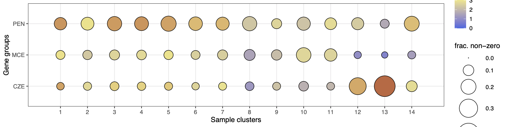
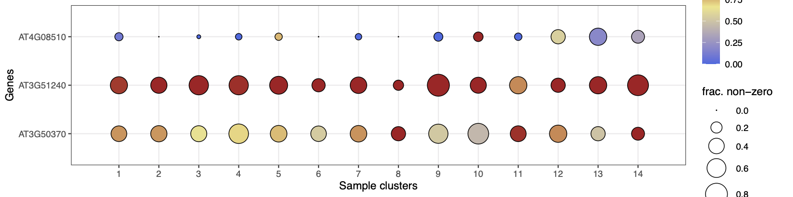
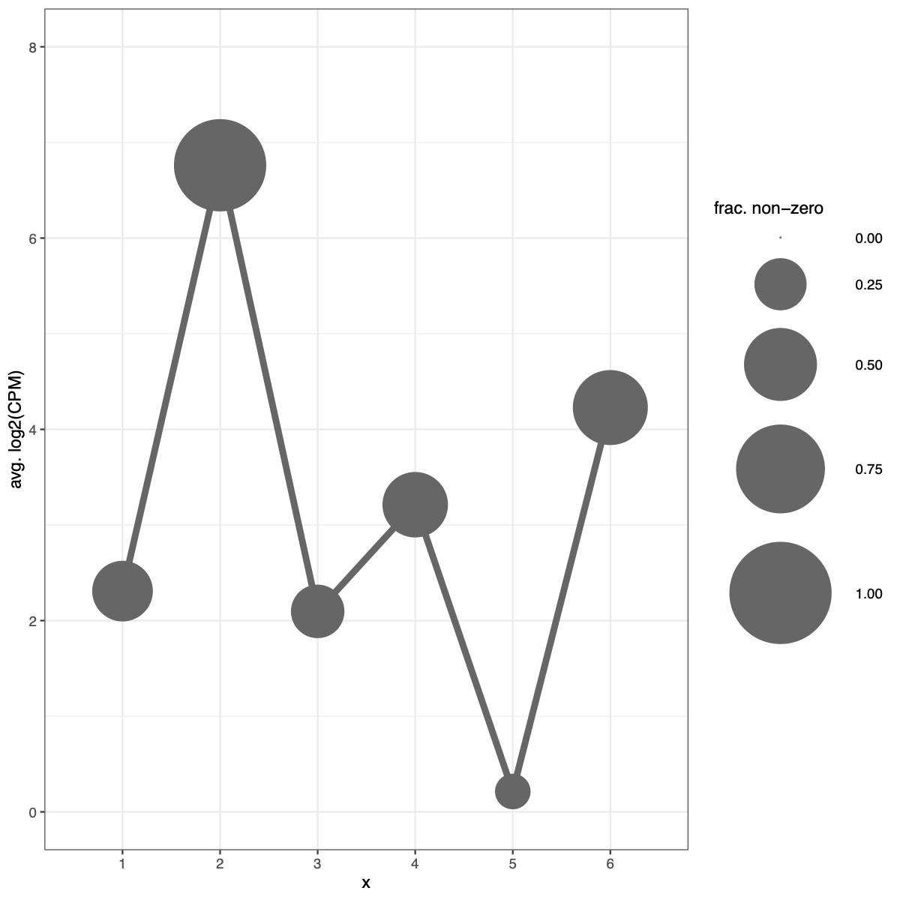
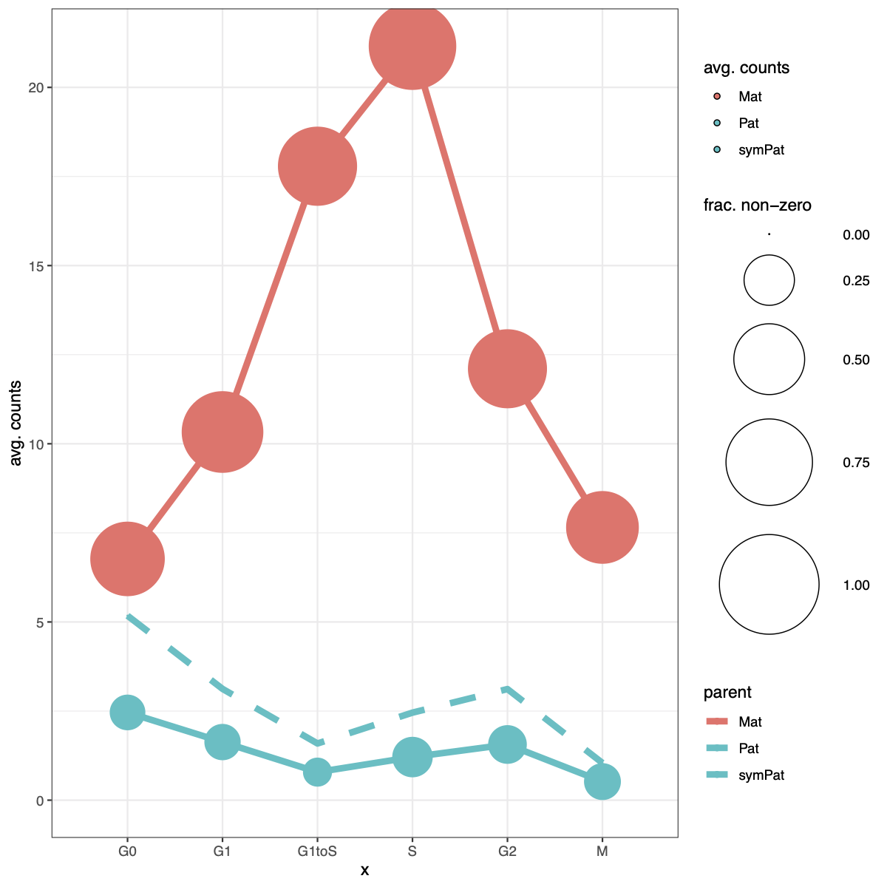
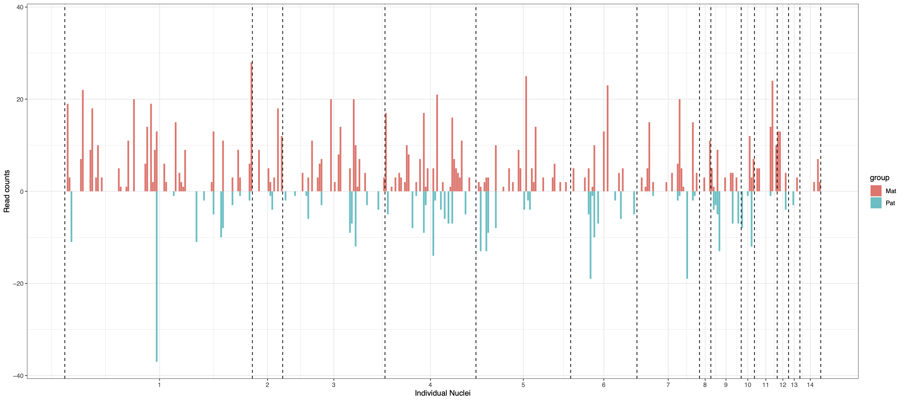
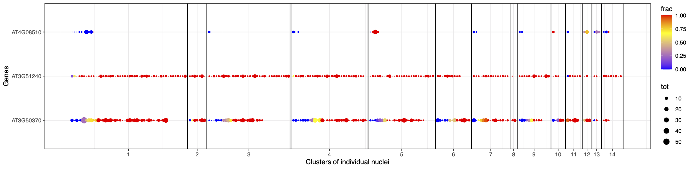
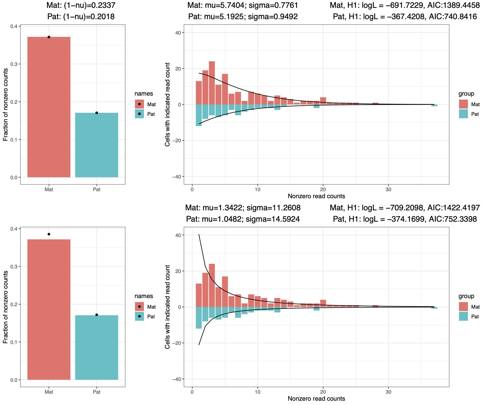
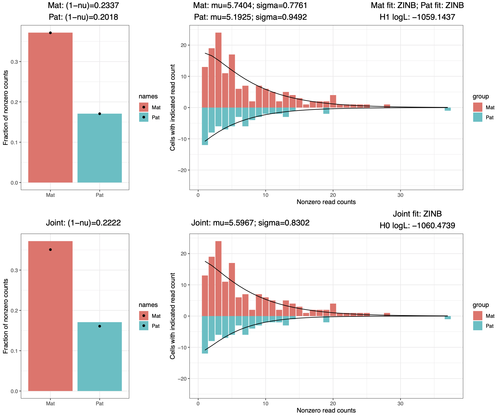
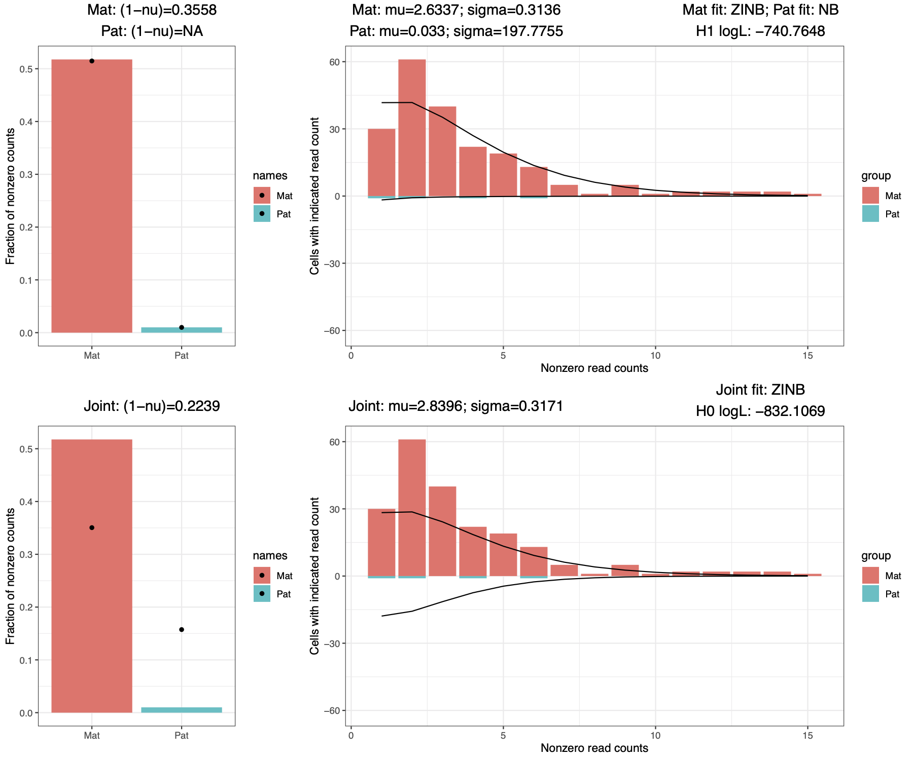
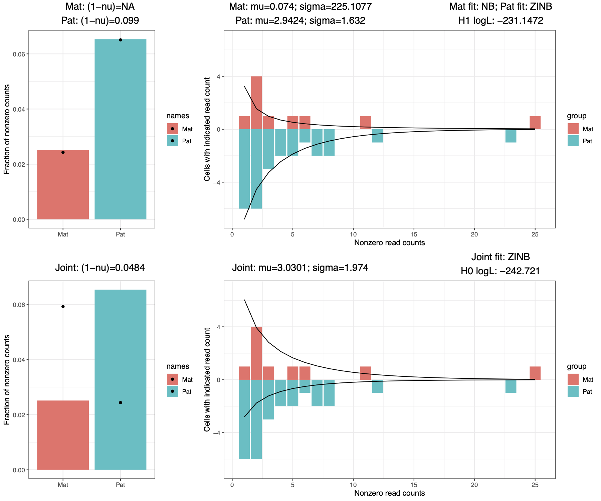

# Endosperm snRNA-seq analysis v.1.0
Scripts and files used in Picard et al. (2021). This readme outlines how to use snRNAseq_analysis_main.sh to rerun all analyses in the paper, as well as giving examples for different ways to visualize the data for those who want to explore or look at their favorite genes. 

Publication: TBD.

Associated GEO repository: TBD

Some of this code is also available as part of github repository here: https://github.com/clp90/imprinting_analysis

# Overview of analysis
The full set of analyses performed for this project can be found in `snRNAseq_analysis_main.sh`. The analysis is divided into 9 main steps (see below).

### Example Usage:
(1) To start from beginning: 
```
./snRNAseq_analysis_main.sh -i indir -o outdir -d required_files/snRNAseq_samplist.txt
```

(2) To start from a specific step, for example step 3:
```
./snRNAseq_analysis_main.sh -o outdir -d required_files/snRNAseq_samplist.txt -3
```

(3) To test that all dependencies are properly installed/can be located without running the script itself:
```
./snRNAseq_analysis_main.sh -0
```

### Main analysis steps:
- Step 1) Align reads to metagenome, get alignment stats (Fig. S1)
- Step 2) Get per-gene read counts and CPMs for each library (Fig. S1)
- Step 3) Identify nuclei passing basic QC, filter out neg/pos ctrls and examine spike-ins (Fig. S1, S2)
- Step 4) Clustering by tSNE and SC3, assign tissue of origin based on clustering (Fig. 1, Ext. data Figs. 1, 2, 3)
- Step 5) Cell cycle analysis (Ext. data Fig. 7, Figs. S6, S7)
- Step 6) Identify DE genes between 4 DAP endosperm and seed coat clusters
- Step 7) Identify imprinted genes from 4 DAP endosperm nuclei (Fig. 3, Ext. data Fig. 8, Figs. S8-S12)
- Step 8) Characterize clusters by examining patterns of overall and allele-specific expression over cell cycle & clusters (Figs. 1, 3, Ext. data Figs. 3-5, 9, Figs. S4,S5,S13-S16)
- Step 9) Additional analyses/plots (Fig. 3, Ext. data Fig. 3, 9, Figs. S2, S3, S13, S16)

### Required arguments:

- Required file snRNAseq_samplist.txt is a tab-del file containing a description of each library, currently with the following
	fields (in this order!):
	```
  sampID	project	sort_date	well	libname	seqtype	cross	dap	n_nuc	peak	stage	stagecode	batch	platform	final ERCC dil.
  D17-187001	171003Geh	8/10/17	2A	P1_2A	single	CxV	3	1	6N	early heart	2	1	HiSeq 2000	0
  D17-187002	171003Geh	8/10/17	2B	P1_2B	single	CxV	3	1	6N	early heart	2	1	HiSeq 2000	1:10M
  D17-187003	171003Geh	8/10/17	2C	P1_2C	single	CxV	3	1	6N	early heart	2	1	HiSeq 2000	1:50M
  D17-187004	171003Geh	8/10/17	2D	P1_2D	single	CxV	3	1	6N	early heart	2	1	HiSeq 2000	1:100M
  D17-187005	171003Geh	8/10/17	2E	P1_2E	single	CxV	3	1	6N	early heart	2	1	HiSeq 2000	1:200M
  ```
	This file is provided in the github repo here: required_files/snRNAseq_samplist.txt

- Point -i to the directory containing all the raw sequencing files named according to the 'libname' field in required_files/snRNAseq_samplist.txt. 
	For example, the fastq file for the first sample in the file (P1_2A) should be named P1_2A.fastq. Paired-end files (run on 
	Nextseq) should be named e.g. P11_1A_R1.fastq and P11_1A_R2.fastq for forward and reverse reads, respectively.

- Point -o to a suitable output directory. Can use an existing directory, although
	files will be re-generated and overwritten if they existed already in that directory so use with
	caution. If not starting from beginning, must point to the output directory used for previous runs.
  
### Full Usage and dependencies for snRNAseq_analysis_main.sh given at the bottom of this readme.

# Visualizing the data
We have included an R script, single_cell_RNAseq_plots.R, that can make several different types of plots from the data, given count matrices.

- Count matrices (total expression CPM matrix `GSE157145_CPM_total_expression.txt` and maternal/paternal normalized count matrices `GSE157145_norm_maternal_counts.txt` and `GSE157145_norm_paternal_counts.txt`) can be downloaded from GEO here: TBD. These contain normalized CPM or counts for all CxV and VxC endosperm and seed coat nuclei (total expression matrix) and for all CxV and VxC endosperm nuclei (mat/pat matrices).
- Two plot types ('gof' and 'cmp') always use all nuclei in the input matrix, with no option to specify to use only a specific subset. For these, mat/pat matrices containing CxV and VxC nuclei separately were added to other_files/ (`ASE_[CxV/VxC]_[m/p]counts_norm_fxheader.txt`).

### 'dot' plots (ex. Fig. 1c)
Makes dot plots of total expression or % maternal of either one or more genes, or averaged across groups of multiple genes (ex. MEGs, PEGs, etc.), over groups of nuclei (e.g. nuclei clusters). Dot size indicates the fraction of informative nuclei (non-zero counts), while dot color indicates average total expression or % maternal. Note that nuclei groups in --sampfile do not need to be numeric (see 'lin' example with cell cycle phases instead).

Average total expression over LCM marker genes from Belmonte et al. over CxV endosperm clusters (see Fig. 1c):
```
scripts/single_cell_RNAseq_plots.R dot example_plots/dot_expr --CPM GSE157145_CPM_total_expression.txt --sampfile other_files/CxV_endo_4DAP_final_clusters_noheader.txt --genefile other_files/Belmonte_all_markers_g_to_h.txt --yorder PEN,MCE,CZE --fillupper 6 --sizeupper 0.4 --dotsize 15 --allowmissinggenes
```


Average % maternal of three genes (a PEG, a MEG, and an unbiased gene) over CxV endosperm clusters:
```
scripts/single_cell_RNAseq_plots.R dot example_plots/dot_impr --mcounts GSE157145_norm_maternal_counts.txt --pcounts GSE157145_norm_paternal_counts.txt --sampfile other_files/CxV_endo_4DAP_final_clusters_noheader.txt --genes AT3G50370,AT3G51240,AT4G08510
```


### 'lin' connected line plots (ex. Fig. 3c)
Makes connected dot plots of total expression or mat/pat expression for a single gene, across groups of nuclei (e.g. nuclei clusters). Dot size indicates the fraction of informative nuclei (non-zero counts), while y-axis value indicates average total expression of nuclei in that group. When plotting mat/pat expression, can optionally add a line simulating 2x paternal counts, which theoretically should resemble maternal expression levels unless the gene is imprinted.

Example 1 - average total expression of AT1G79840/GLABRA2 over CxV seed coat clusters (Extended data Fig. 3d):
```
scripts/single_cell_RNAseq_plots.R lin example_plots/lin_expr --CPM GSE157145_CPM_total_expression.txt --sampfile other_files/CxV_seedcoat_4DAP_final_clusters_noheader.txt --dotsize 30 --sizeupper 1 --ymin 0 --ymax 8 --includezeros --plotwidth 8 --genes AT1G79840
```

Example 2 - average mat/pat expression of AT5G48650 over cell cycle phases (CxV and VxC endosperm nuclei only) (Fig. S16b):
```
scripts/single_cell_RNAseq_plots.R lin example_plots/lin_impr --mcounts GSE157145_norm_maternal_counts.txt --pcounts GSE157145_norm_paternal_counts.txt --sampfile other_files/endo_4DAP_nuclei_cell_cycle.txt --dotsize 30 --addsims --noprelog --plotwidth 8 --sizeupper 1 --xorder G0,G1,G1toS,S,G2,M --ymin 0 --genes AT5G48650
```
Example1      |  Example2        
:-------------------------:|:-------------------------:
  |  


### 'bar' plots
Makes a bar chart showing mat/pat expression of all nuclei in the dataset, optionally ordered into groups (e.g. nuclei clusters). Maternal counts are shown as positive values, paternal counts as negative values.

Mat/pat expression of all nuclei for gene AT3G50370 over all CxV 4 DAP endosperm nuclei, arranged according to clustering in Fig. 1b:
```
scripts/single_cell_RNAseq_plots.R bar example_plots/bar --mcounts $outdir/imprinting_analysis/all_mcounts_merged.txt --pcounts $outdir/imprinting_analysis/all_pcounts_merged.txt --sampfile other_files/CxV_endo_4DAP_final_clusters_noheader.txt --genes AT3G50370
```


Can also be used to plot total expression in individual nuclei instead of mat/pat expression (use --CPM instead of --mcounts/--pcounts).

### 'nuc' individual nuclei plots
Similar to 'bar' in terms of info content, but more easily shows multiple genes instead of just one. Each gene is represented by a row of dots, corresponding to cells/nuclei. Each dot's size is a function of number of allelic reads are present, color is a function of % maternal. 

Plot of a PEG, a MEG, and an unbiased gene over all CxV 4 DAP endosperm nuclei, arranged according to clustering in Fig. 1b:
```
scripts/single_cell_RNAseq_plots.R nuc example_plots/nuc --mcounts $outdir/imprinting_analysis/all_mcounts_merged.txt --pcounts $outdir/imprinting_analysis/all_pcounts_merged.txt --sampfile other_files/CxV_endo_4DAP_final_clusters_noheader.txt --genes AT3G50370,AT3G51240,AT4G08510
```


### 'cmp' goodness of fit ZINB vs. NB comparison plots (ex. Fig. S8)
Goodness-of-fit plot that compares the ZINB and NB best fits, separately for both mat and pat counts. Used for fitting mat/pat counts for ASE analysis. See supplement for details on statistical framework. Uses a set of parameters identified during ASE analysis (see scripts/single_cell_ASE_analysis.R), provided in other_files/.

Example of a gene where ZINB fit is better than NB fit, see Fig. S8:
```
scripts/single_cell_RNAseq_plots.R cmp example_plots/cmp --mcounts other_files/ASE_CxV_mcounts_norm_fxheader.txt --pcounts other_files/ASE_CxV_pcounts_norm_fxheader.txt --ASE_params other_files/ASE_CxV_paramslist.txt --genes AT3G50370
```


### 'gof' (goodness of fit) plots
Goodness-of-fit plot that compares the fit of H1 (separate mat and pat fits) and H0 (joint fit) distribution for maternal and paternal counts, for a single gene. Used to identify genes with sufficient maternal or paternal bias to deviate from H0, possibly indicating imprinting. See supplement for details on statistical framework. Uses a set of parameters identified during ASE analysis (see scripts/single_cell_ASE_analysis.R), provided in other_files/. For this type of plot, the input matrix must contain all nuclei to be plotted (in the examples below, all CxV endosperm nuclei).

Example:
```
scripts/single_cell_RNAseq_plots.R gof example_plots/gof --mcounts other_files/ASE_CxV_mcounts_norm_fxheader.txt --pcounts other_files/ASE_CxV_pcounts_norm_fxheader.txt --ASE_params other_files/ASE_CxV_paramslist.txt --genes AT3G50370
```
AT3G50370 (unbiased)       |  AT3G51240 (MEG)          |  AT4G08510 (PEG)
:-------------------------:|:-------------------------:|:-------------------------:
  |    |  

For the unbiased gene H0 and H1 are roughly equivalent, while H1 (separate mat/pat fits) is significantly better for both the MEG and the PEG.


## Full Usage and Dependencies for snRNAseq_analysis_main.sh

### Usage:
```
snRNAseq_analysis_main.sh [options] -d descfile.txt -o outdir

User-specified options:
Required arguments:
	-d descfile : file containing list of samples (see above for expected fields)
	-o outdir : where to put all output files from this project
Additional arguments:
	-i indir : folder containing all the raw data from all libraries (see above for expected format); only required if starting from step 1
	-p path_to_pipelines : path to folder containing all required pipeline scripts (see list below) [default assumes in same directory as this script]
	-s path_to_scripts : path to folder containing all required helper scripts (see list below) [default assumes in a scripts/ subdirectory relative to this script]
	-f path_to_files : path to folder containing all required other files (see list below) [default assumes in a required_files/ subdirectory relative to this script]
Flag options:
	-0 : checks that all required programs installed on PATH and all required helper scripts and other files can be located, then exits without running
	-[step] : skip to step [step] ([step] can be values 2-9, for example -8 will skip to step 8)
	-h : prints this version and usage information
```

### Dependencies:

#### STAR-indexed metagenome
Requires STAR-indexed 'metagenomes' of Col(TAIR10)+Ler+ERCC and Col+Cvi+ERCC, which must be in `required_files/genomes/` in folders named `TAIR10_Ler_ERCC_OH50` and `TAIR10_Cvi_ERCC_OH50` respectively. These can be generated using `make_metagenome.py` in the scripts/ folder, described here:
	- https://dx.doi.org/10.1007/978-1-0716-0179-2_13
	- https://github.com/clp90/imprinting_analysis  
Required for generating metagenomes:
- TAIR10.fa (download from [here](https://www.arabidopsis.org/download/index-auto.jsp?dir=%2Fdownload_files%2FGenes%2FTAIR10_genome_release%2FTAIR10_chromosome_files))
- araport11 annotations (in `other_files/` with minor fix of overlapping exons)
- ERCC 'genome' (in `other_files/`)
- Col/Cvi and Col/Ler SNP files (in `required_files/`
Generating Col+Cvi+ERCC metagenome:
```
snpfile="required_files/Col_Cvi_SNPs_clean.bed"
TAIR10="path/to/TAIR10.fa"
annot="other_files/Araport11_GFF3_genes_transposons.201606.fx.gtf"
ERCC="other_files/ERCC92.fa"

# make metagenome
mkdir "required_files/genomes/A_thaliana_TAIR10_Cvi"
scripts/make_metagenome.py --refchar C --altchar V --refname Col --altname Cvi --GTF "$annot" "$snpfile" "$TAIR10" required_files/genomes/A_thaliana_TAIR10_Cvi/TAIR10_Cvi > "${outprefix}_log.txt"

# append ERCC 'genome' to TAIR10+Cvi
mkdir "required_files/genomes/A_thaliana_TAIR10_Cvi_ERCC"
cat required_files/genomes/A_thaliana_TAIR10_Cvi/TAIR10_Cvi.fa "$ERCC" > "required_files/genomes/A_thaliana_TAIR10_Cvi_ERCC/TAIR10_Cvi_ERCC.fa"
cat required_files/genomes/A_thaliana_TAIR10_Cvi/TAIR10_Cvi_metagtf.gtf ERCC_spikeins/ERCC92.gtf > "required_files/genomes/A_thaliana_TAIR10_Cvi_ERCC/TAIR10_Cvi_ERCC_metagtf.gtf"
cp required_files/genomes/A_thaliana_TAIR10_Cvi/TAIR10_Cvi_metachrom.txt "required_files/genomes/A_thaliana_TAIR10_Cvi_ERCC"

# make STAR index of TAIR10+Cvi+ERCC (takes a while)
STAR --runMode genomeGenerate --outFileNamePrefix required_files/genomes/TAIR10_Cvi_ERCC_OH50 --genomeDir required_files/genomes/TAIR10_Cvi_ERCC_OH50 --genomeFastaFiles required_files/genomes/A_thaliana_TAIR10_Cvi_ERCC/TAIR10_Cvi_ERCC.fa --sjdbGTFfile required_files/genomes/A_thaliana_TAIR10_Cvi_ERCC/TAIR10_Cvi_ERCC_metagtf.gtf --sjdbOverhang 50
```

#### Required programs, packages and scripts
Versions of programs that were used indicated in brackets; links provided where possible.
1. Required installed on user PATH:
	- `bedtools` (by Aaron R Quinlan and Ira M Hall) [v2.23.0] [link](https://bedtools.readthedocs.io/en/latest/)
	- `samtools` ((c) Genome Research Ltd.) [v.1.11] [link](http://www.htslib.org)
	- `python` v.2.x.x (Python Software Foundation) [v2.7.17] [link](https://www.python.org/downloads/release/python-2717/)
	- `R` (R Core Team) [v3.6.3] [link](https://www.r-project.org)
  	- `fastqc` (Andrews 2010) [v0.11.8] [link](https://www.bioinformatics.babraham.ac.uk/projects/download.html#fastqc)
  	- `trim_galore` (Krueger 2012) [v0.5.0] [link](https://www.bioinformatics.babraham.ac.uk/projects/trim_galore/)
 	- `STAR` (Dobin *et al.* 2012) [v2.6.1d] [link](https://github.com/alexdobin/STAR)
  	- `Java 1.8+` [v1.8.0_191] [link](https://www.java.com/en/download/manual.jsp)
	
2. Must be in path_to_pipelines (included in repository):
	- `rna_seq_map.sh` (by CLP)
	
3. Must be in path_to_scripts (included here in scripts/ subfolder):
	- `MarkDuplicates.jar` (part of the picard-tools suite, Broad Institute) [1.121]
	- `assign_to_allele.py` (by CLP)
	- `barchart.R` (by CLP)
	- `cluster_gene_expression.R` (by CLP)
	- `gene_overlaps_dotplot.R` (by CLP)
	- `merge_by_column.R` (by CLP)
	- `merge_many_files.sh` (by CLP)
	- `piechart.R` (by CLP)
	- `plot_SC3_heatmap.py` (by CLP)
	- `run_DEsingle.R` (by CLP)
	- `run_topGO.R` (by CLP)
	- `scatterplot.R` (by CLP)
	- `single_cell_ASE_analysis.R` (by CLP)
	- `single_cell_ASE_src.R` (by CLP)
	- `single_cell_RNAseq_plots.R` (by CLP)
	- `single_cell_cluster_PCA_tSNE.R` (by CLP)
	- `single_cell_cluster_SC3.R` (by CLP)
	- `single_cell_simulate_reads.R` (by CLP)
	- `single_cell_trajectory_analysis.R` (by CLP)
	- `subset_large_file.R` (by CLP)
	- `check_dependencies.R` (by CLP)

4. Must be in path_to_files (included here in required_files/ subfolder):
	- `TAIR10_plus_araport11_nonoverlapping.gtf`
	- `araport11_TEs_not_in_genes.gtf`
	- `ERCC_spikeins/ERCC92.gtf`
	- `genomes/TAIR10_Cvi_ERCC_OH50`
	- `genomes/TAIR10_Cvi_metachrom.txt`
	- `Col_Cvi_SNPs_clean.bed`
	- `genomes/TAIR10_Ler_ERCC_OH50`
	- `genomes/TAIR10_Ler_metachrom.txt`
	- `Col_Ler_SNPs_clean.bed`
	- `ERCC_chrlist.txt`
	
5. Required R packages:
	- See `scripts/check_dependencies.R`	
	
6. Required python packages:
	- `argparse` (Thomas Waldmann) [1.1]
	- `numpy` (Travis E. Oliphant et al.) [1.15.1]
	- `cutadapt` (Martin 2011) [1.18]

### Notes: 

- Although `snRNAseq_analysis_main.sh` should rerun every analysis in the paper, it is very long, has a lot of dependencies, and was designed
	to run on the Whitehead Institute cluster, an LSF cluster (and uses the LSF framework to send out jobs). So it probably won't work 
	out of the box on most setups, particularly on clusters using other schedulers, and will need to be adjusted to run on those. 
  It can also simply serve as a record of the analyses and code used for the paper.
  
- Given its length, snRNAseq_analysis_main.sh can be restarted from the beginning of each of its 9 parts without re-running the previous parts (some parts do rely on output of prior parts, and this is *not* properly checked, however). For example, this will restart the analysis from step 3, assuming steps 1 and 2 already successfully completed and are stored in myoutdir/ already:
```
./snRNAseq_analysis_main.sh -o myoutdir -d required_files/snRNAseq_samplist.txt -3
```

- Relevant files from that github are included in this repo for simplicity where possible in either required_files/ or other_files/. STAR indexes for metagenomes are not included (see above for how to generate them).
	
- All custom helper scripts for `snRNAseq_analysis_main.sh` are provided in either the same directory as the main script, or the scripts/ subdirectory. By default, this script will look for those files in those locations without the user needing to specify anything. However, if any of those files are moved relative to this script, then you can re-point to the required scripts and files using the -p, -s and -f options.
- Most scripts have detailed header sections with more information on what the script is intended to do.


